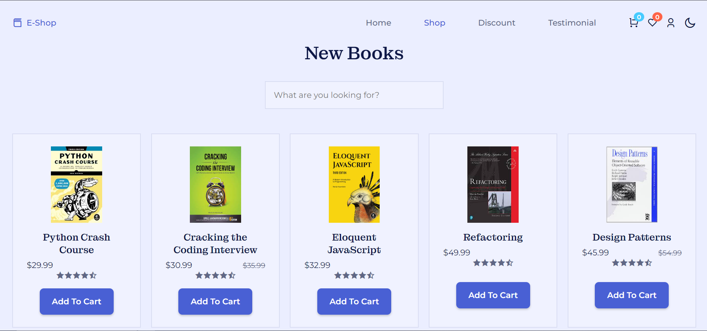
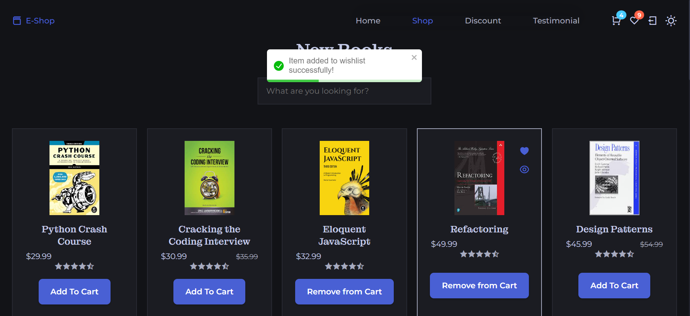
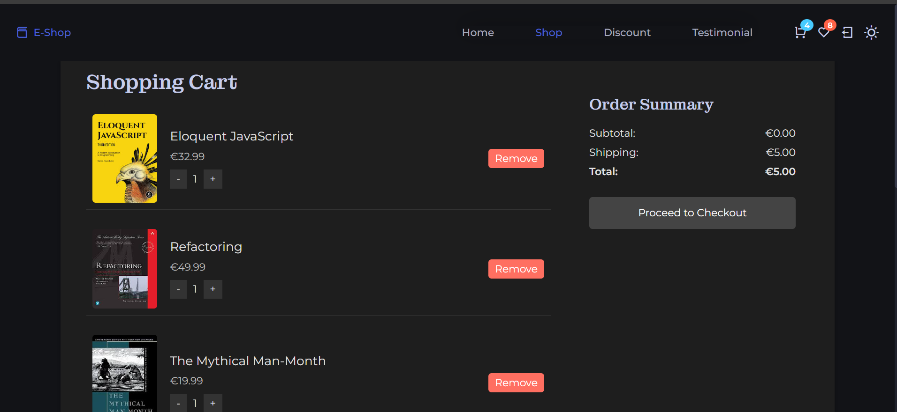
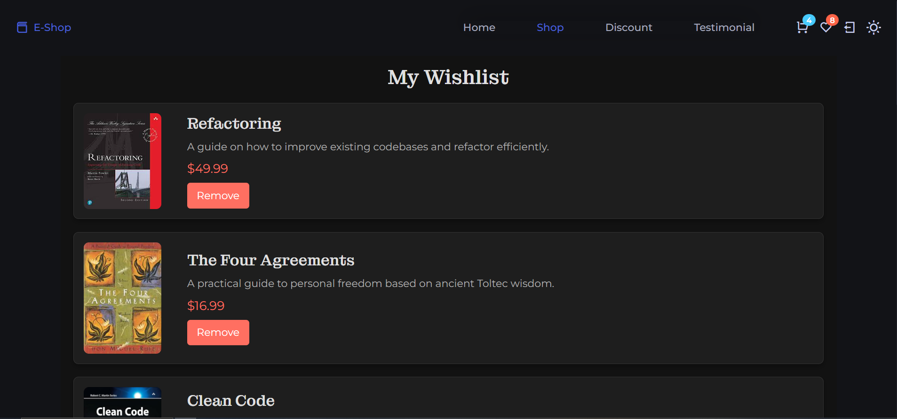
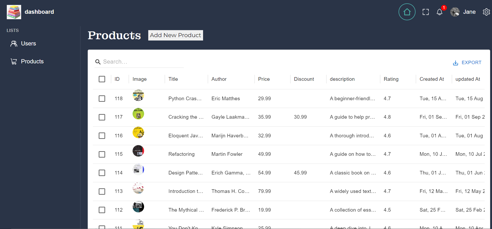

# BookShop

BookShop is an e-commerce application for browsing and purchasing books. The project includes a Flask backend for handling API requests and a React frontend for the user interface.

<!-- **Deployed Site**: [Live Demo](https://example.com) -->

<!-- **Blog Article**: [Final Project Blog](https://example.com/blog) -->

**Authors**:  
- Kareem Hany ([LinkedIn](https://www.linkedin.com/in/kareemhany/)) - Backend Developer  
- Youssef Ahmed ([LinkedIn](https://www.linkedin.com/in/youssef-ahmed-046072254/)) - Backend Developer  
- Sayed Abdelaal ([LinkedIn](https://www.linkedin.com/in/sayed-abdelaal-22144024b/)) - Frontend Developer  

## Table of Contents

- [Features](#features)
- [Technology Stack](#technology-stack)
- [Installation](#installation)
- [Usage](#usage)
- [Contributing](#contributing)
- [License](#license)
- [Screenshots](#screenshots)
- [Admin access](#admin-access-for-demo-purposes)
- [Story and Technical Details](#story-and-technical-details)

## Features

- [x] User authentication (register, login, logout, reset password, login with google)
- [x] Cart functionality (add, view, update, and remove items)
- [x] Wishlist management
- [x] Book catalog with search and filter options
- [x] Checkout process
- [x] Admin dashboard for managing books, users, and orders

## Technology Stack

- **Frontend:** React, HTML, CSS, TypeScript, Redux
- **Backend:** Python, Flask, SQLAlchemy
- **Database:** SQLite
- **Authentication:** Session 
- **Dependency Management:** pip, virtualenv

## Installation

1. **Clone the Repository**

   ```bash
   git clone https://github.com/sayedabdelal/BookShop.git
   cd BookShop
   ```

2. **Install the backend dependencies**

   ```bash
   pip install -r requirements.txt
   ```

3. **Install frontend dependencies**
   ```bash
   cd frontend
   npm install
   ```

4. **Run the frontend development server**
   ```bash
   npm run dev
   ```

5. **Run the backend server**
   ```bash
   cd ..
   ./run_backend.py
   ```

6. **Open the webiste**

      Navigate to http://localhost:5173/ in your browser.


## Usage
1. Create an account and log in.
2. Browse through available book in shop or use the search feature to find books.
3. Add books to your cart and proceed to checkout.
4. Manage your cart and wishlist.
5. Add favorite books to your wishlist.

## Contributing
Contributions are welcome! If you'd like to contribute, please fork the repository and create a new branch with your feature or bug fix.

1. Fork the repository
2. Create a new feature branch
3. Push your changes
4. Create a pull request

## Related Projects
[Dragons Project](https://github.com/Oxshady/dragons)

[Tic Tac Toe Game](https://github.com/Oxshady/tic_tac)

## License
This project is licensed under the MIT License. See the [LICENSE](https://github.com/sayedabdelal/BookShop/blob/main/LICENSE) file for more details.

## Screenshots
 *Homepage*


 *Shop Page*


**Dark mode enabled! After login, you can add items to the cart or wishlist.**

 *Add to Cart (Dark Mode)*


 *Cart Page*


 *Wishlist Page*


**Admin dashboard for managing users and books:**

 *Admin User Management*


 *Admin Product Management*


## Admin Access (For Demo Purposes)

If you'd like to explore the admin dashboard, you can use the following credentials:

- **Email**: admin@gmail.com
- **Password**: admin1234

> **Note**: These credentials are only for demo purposes and should not be used in production environments.


## Story and Technical Details
The inspiration for BookCorner came from a need to simplify the book shopping experience. I wanted to create a platform where users could easily find books, manage their carts, and make purchases without hassle.

### Technical Challenges
One of the biggest challenges was managing user authentication and secure sessions across the frontend and backend. Flask's session management, along with React's state handling, required careful configuration to ensure that users remained logged in across different sessions.

Another area of focus was ensuring the smooth operation of cart and wishlist functionality. I also learned the importance of handling asynchronous operations with React Query and making API calls to the backend.

### Future Iterations
In the next iteration, I aim to:

- Add user reviews and book ratings
- Implement a recommendation engine based on purchase history
- Further enhance the search functionality with filters for author, price, and publication year
